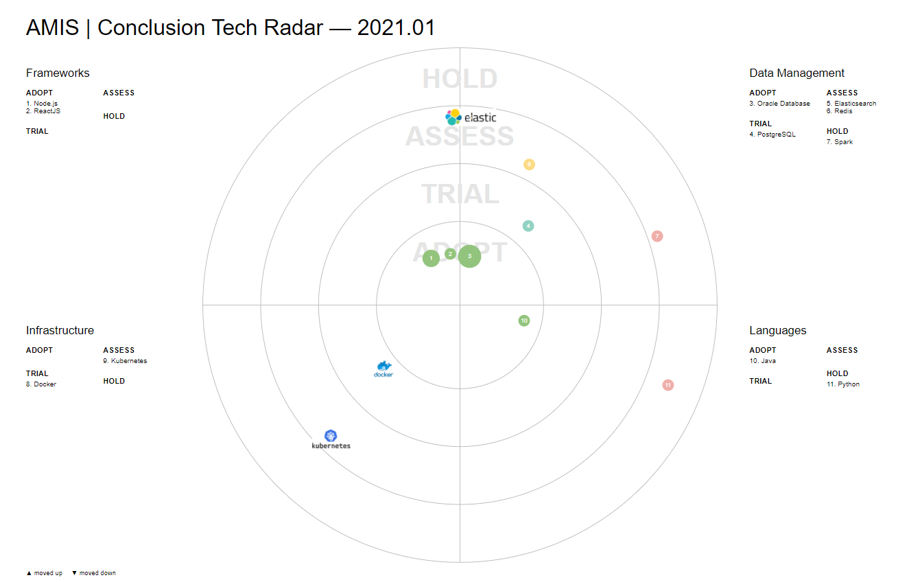

# AMIS | Conclusion Technology Radar

Clone from the Zalando Tech Radar (https://github.com/zalando/tech-radar)

A number of modifications are intended:
= technology selection for AMIS
- richer data model for the blips (the entries in the radar)
- extended presentation for the blips
  - size
  - color
  - shape
  - content of bubble/balloon text
  - filter on labels
  - tag cloud for the labels?
  - additional attributes for blips: 
    - rationale
    - logo
    - vendor
    - priority/weight (volume)


# Entries
The file entries.js contain the data that is visualized in the radar. This seem data could be retrieved using an HTTP request to an API or from an external URL.

Each entry represents both:
* objective: a technology, concept, product, cloud service, open source project
* subjective: our and the community's assessment (the blip on the radar)

For both angles, there are several properties identified for each entry:

## Objective properties
* name/label
* description
* logo
* homepage
* vendor /sponsor
* birthyear / year of first occurrence
* timestamp of last major release
* category (for example concept, technique/process, tool, platform & infra, language, framework/library - something that becomes part of custom software)
* licenseModel (oss, commercial)
* tags (more descriptors that characterize the entry - for example: database, nosql, managed, saas, container, security )

## Context sensitive properties 
* who
* when
* scope (personal, department, company, ecosystem, world)
* community sentiment (market share, GitHub stars, stackoverflow activity, appetite, ...)
* analyst rating
* current status (where are we now? )
* ambition/ desired status (for example: wait, investigate, learn, apply (full force), retire/reduce, do not use anymore)
* size/relevance/scale 
* rationale/motivation (explanation of the the subjective ratings)

# Radar elements

The radar has a well known appearance. It shows four concentric circles - the rings - that are divided into four areas by two orthogonal lines (that could be interpreted as axes) - the quadrants. The rings and quadrants are used to convey information: the location of each entry on the radar is meaningful.

Traditionally, the rings indicate the status assigned to an entry (hold, assess, trial, adopt are the original values) and the quadrants indicate the category of an entry (for examples tools, platforms, languages & frameworks, techniques).  

These work fine. However, it is quite possible to also present the entries in different configurations of the quadrants and rings.

* Quadrants - the radar is divided into four areas; these areas can be made to mean different things. A common designation is by category. Another could be by status (growth-share matrix, Gartner hypecycle, Gartner maqic qudadrant/Forrester Wave) or by any other grouping (such as AWS, Azure, GCP and others) or even by assessment (which is originally plotted in rings) 
* Rings - the four rings originally were used to visualize assessment (hold, assess, trial, adopt - indicating the ambition); rings can be used in different ways - such as maturity (how long a technology has been around), relevance to the company, community sentiment, marketshare, number of users within company
* Blips - each entry (tool, technology, ..) is plotted somewhere on the radar - in a quadrant and a ring. The blip itself can have visual characteristics: size, color, shape, icon. Each visual characteristic can be used to express something. For example: size to indicate the relative importance, color or shape to indicate ambition (while ring is used to indicate current situation) or vibrancy (how alive and kicking is the entry - based on market adoption, community activity, vendor involvement, release). Note: instead of plotting shapes we could use logo's or name badges for plotting the blips; we lose some of the details, but gain in instant recognition.  


# Original Motivation by Zalando

At [Zalando](http://zalando.de), we maintain a [public Tech

Radar](http://zalando.github.io/tech-radar/) to help our engineering teams
align on technology choices. It is based on the [pioneering work
by ThoughtWorks](https://www.thoughtworks.com/radar).

This repository contains the code to generate the visualization:
[`radar.js`](/docs/radar.js) (based on [d3.js v4](https://d3js.org)).
Feel free to use and adapt it for your own purposes.

## Usage

1. include `d3.js` and `radar.js`:

```html
<script src="https://d3js.org/d3.v4.min.js"></script>
<script src="http://zalando.github.io/tech-radar/release/radar-0.5.js"></script>
```

2. insert an empty `svg` tag:

```html
<svg id="radar"></svg>
```

3. configure the radar visualization:

```js
radar_visualization({
  svg_id: "radar",
  width: 1450,
  height: 1000,
  colors: {
    background: "#fff",
    grid: "#bbb",
    inactive: "#ddd"
  },
  title: "My Radar",
  quadrants: [
    { name: "Bottom Right" },
    { name: "Bottom Left" },
    { name: "Top Left" },
    { name: "Top Right" }
  ],
  rings: [
    { name: "INNER",  color: "#93c47d" },
    { name: "SECOND", color: "#b7e1cd" },
    { name: "THIRD",  color: "#fce8b2" },
    { name: "OUTER",  color: "#f4c7c3" }
  ],
  print_layout: true,
  entries: [
   {
      label: "Some Entry",
      quadrant: 3,          // 0,1,2,3 (counting clockwise, starting from bottom right)
      ring: 2,              // 0,1,2,3 (starting from inside)
      moved: -1             // -1 = moved out (triangle pointing down)
                            //  0 = not moved (circle)
                            //  1 = moved in  (triangle pointing up)
   },
    // ...
  ]
});
```

Entries are positioned automatically so that they don't overlap.

As a working example, you can check out `docs/index.html` &mdash; the source of our [public Tech
Radar](http://zalando.github.io/tech-radar/).

## Local Development

1. install dependencies with yarn (or npm):

```
yarn 
```

2. start local dev server:

```
yarn start
```

3. your default browser should automatically open and show the url
 
```
http://localhost:3000/
```

## License

```
The MIT License (MIT)

Copyright (c) 2017 Zalando SE

Permission is hereby granted, free of charge, to any person obtaining a copy
of this software and associated documentation files (the "Software"), to deal
in the Software without restriction, including without limitation the rights
to use, copy, modify, merge, publish, distribute, sublicense, and/or sell
copies of the Software, and to permit persons to whom the Software is
furnished to do so, subject to the following conditions:

The above copyright notice and this permission notice shall be included in
all copies or substantial portions of the Software.

THE SOFTWARE IS PROVIDED "AS IS", WITHOUT WARRANTY OF ANY KIND, EXPRESS OR
IMPLIED, INCLUDING BUT NOT LIMITED TO THE WARRANTIES OF MERCHANTABILITY,
FITNESS FOR A PARTICULAR PURPOSE AND NONINFRINGEMENT. IN NO EVENT SHALL THE
AUTHORS OR COPYRIGHT HOLDERS BE LIABLE FOR ANY CLAIM, DAMAGES OR OTHER
LIABILITY, WHETHER IN AN ACTION OF CONTRACT, TORT OR OTHERWISE, ARISING FROM,
OUT OF OR IN CONNECTION WITH THE SOFTWARE OR THE USE OR OTHER DEALINGS IN
THE SOFTWARE.
```
